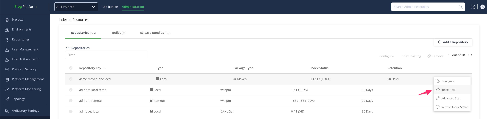
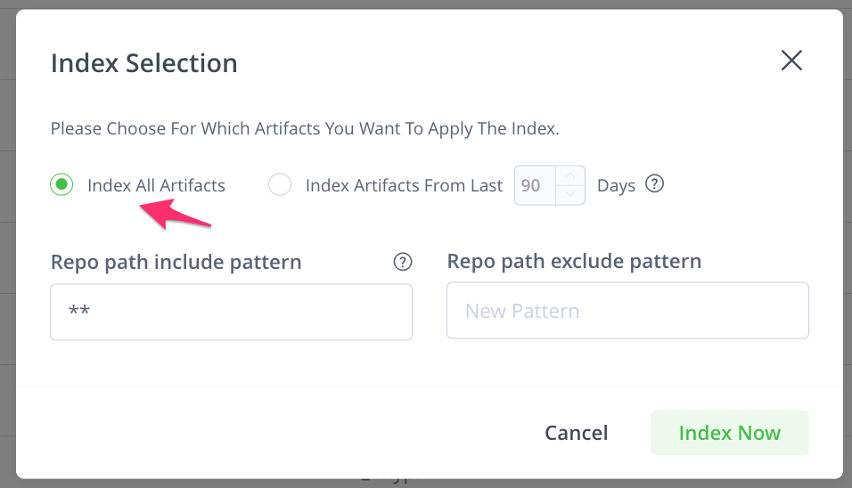

## The Binary Manager
How to find the binary manager i.e Artifactory ID to use with [Get Binary Manager](https://jfrog.com/help/r/xray-rest-apis/get-binary-manager)  API ?
i.e What is the {ID} in `GET /api/v1/binMgr/{id}` ?

The {id} variable pertains to the id of the binary manager (Artifactory) which can be retrieved via the
[Get Binary Manager](https://jfrog.com/help/r/xray-rest-apis/get-binary-manager)  API as follows using `jq`:

```text
jf xr curl "/api/v1/binMgr" --server-id YOUR-JF-CLI-SERVER-ID -s | jq -r '.[].binMgrId' | sort | uniq
```
The `jq` parses the below json and will give the id of the binary manager as shown below:
```
[
  {
    "binMgrId": "default",
    "binMgrUrl": "http://localhost:8046/artifactory",
    "license_valid": true,
    "id": "dec445ed-df72-4aa1-8687-3279da4a6473",
    "version": "7.64.7",
    "indexed_builds": [
      {
        "name": "npm_build"
      }
    ]
  }
]
```

Output:
```text
default
```

---

## Index release bundle

Script to index/scan each artifact in a release bundle:
[211812](https://jfrog.lightning.force.com/lightning/r/EmailMessage/02s6900002io63OAAQ/view)
```bash

#!/bin/bash

# Fetch the list of artifact paths from the source Artifactory
curl -u user:password1 -X GET "https://<SOURCE-ARTIFACTORY>/distribution/api/v1/release_bundle/<insert bundle name here>/LATEST?format=json" \
    | jq -r '.artifacts[] | .targetRepoPath' > files-bundle.txt

# Iterate over each artifact path and send a request to the destination Artifactory for indexing
while read -r line; do
    curl https://<DESTINATION-ARTIFACTORY>/xray/api/v2/index -u user:password2 -XPOST \
        -d '{"repo_path":"'"$line"'"}' \
        -H "content-type: application/json"
done < files-bundle.txt

# Remove the temporary file
rm files-bundle.txt

```

---

## Repos:
Get the Xray specific repository configuration:

Use the API ["Get Repositories Configurations"](https://jfrog.com/help/r/xray-rest-apis/get-repositories-configurations)
With jf cli : 
```bash
jf xr  curl /api/v1/repos_config/<REPOSITORY-NAME> --server-id=YOUR-JF-CLI-SERVER-ID | jq

For example:

jf xr  curl /api/v1/repos_config/acme-maven-dev-local --server-id=mill | jq
```
or

With curl:
```bash
curl --location --request GET "https://${ARTIFACTORY_HOSTNAME}/xray/api/v1/repos_config/<REPOSITORY-NAME>" \
--header "Authorization: Bearer ${ARTIFACTORY_ACCESS_TOKEN}"

For example:

curl --location --request GET "https://${ARTIFACTORY_HOSTNAME}/xray/api/v1/repos_config/teamA-alpine-dev-local" \
--header "Authorization: Bearer ${ARTIFACTORY_ACCESS_TOKEN}"
```

Output for a repo that has `Enable Indexing In Xray`  disabled:
```
{"error":"Request payload is invalid as repo 'sv-maven-local' is either not indexed or does not exist"}
```

Output for a repo that has `Enable Indexing In Xray`  enabled:
```
{"repo_name":"example-repo-local","repo_config":{"retention_in_days":90}
```

---

## Find all repos indexed by Xray:

You can  use the '[Get Repos Indexing Configuration](https://jfrog.com/help/r/jfrog-rest-apis/get-repos-indexing-configuration)' API
to retrieve the indexed and non-indexed repositories for a given binary manager. 

To filter for indexed repositories, you can utilize jq as described in the knowledge base
[Generate Report With All Repositories Included Using REST API](https://jfrog.com/help/r/xray-generate-report-with-all-repositories-included-using-rest-api) :
```text
jf xr curl -XGET "/api/v1/binMgr/default/repos" --server-id YOUR-JF-CLI-SERVER-ID |jq '.indexed_repos | map({name: .name})'

For example:
jf xr curl -XGET "/api/v1/binMgr/default/repos" --server-id soleng |jq '.indexed_repos | map({name: .name})'
```
The `jq` command parses below output:

```
{
    "bin_mgr_id": "default",
    "indexed_repos": [
        {
            "name": "docker-local",
            "type": "local",
            "pkg_type": "Docker"
        }
    ],
    "non_indexed_repos": [
        {
            "name": "debian-local",
            "type": "local",
            "pkg_type": "Debian"
        }
    ]
}
```
Then it will output a list of  repositories indexed by Xray:

```text
[
  {
    "name": "repo1"
  },
  {
    "name": "repo2"
  }
]
```
You can use the script [find_unindexed_repos.sh](find_unindexed_repos.sh)  to  identify repositories of a specified 
type (local, remote, or federated) that are not indexed in a given JFrog Artifactory server as explained in 
[find_unindexed_repos.md](find_unindexed_repos.md)

---

How to check artifacts index status of a repository ?

From XRAY-9863
```
jf xr cl /ui/unified/stats/indexStatus  -H 'Content-Type: application/json'  --data-raw '{"repo_key":"my-repo-key"}' 
--server-id=YOUR-JF-CLI-SERVER-ID

Example:
jf xr cl /ui/unified/stats/indexStatus  -H "Content-Type: application/json"  --data-raw '{"repo_key":"alpine-local"}
' --server-id=psazuse
```
Note: The output below does not clearly indicate if the repository was indexed.
It provides the same output for repositories not enabled for indexing as well.
```
{"completed":0,"potential":1,"started":0}
```
So use the  script [find_unindexed_repos.sh](find_unindexed_repos.sh) instead.

---

What is the rest api to index a repo that is not already indexed for Xray scans?

If your use case is to add the repository to the indexed list, I would recommend using the REST API to update the
repository configuration as mentioned in [Update Repository Configuration](https://jfrog.com/help/r/jfrog-rest-apis/update-repository-configuration)  API.
In short:
1. Create a json file having the below entry for xrayIndex and set it to true.
```text   
{
   "xrayIndex" : true
}
```
2. Now, run the REST API to update the repository configuration and you will see that the repository will be added to the list of Indexed repositories. Below is the example from our lab for your reference:-
```text 
jf rt curl -XPOST "/api/repositories/<repo-name>"  -H "Content-Type: application/json" -T repo.json  
```  
Output:
`Repository <repo-name> update successfully.`

Note: Do not use below API as it will replace the "indexed_repos" with the list you provide:
```
jf xr cl -XPUT /api/v1/binMgr/default/repos  -H "Content-Type: application/json"  \
--data-raw '{"indexed_repos": [
        {
            "name": "ad-nuget-local",
            "type": "local",
            "pkg_type": "Nuget"
        }
    ]
    }' --server-id=psazuse
```
Use the [toggle_enable_indexing_in_xray_for_repos.sh](toggle_enable_indexing_in_xray_for_repos.sh) as mentioned in 
[toggle_enable_indexing_in_xray_for_repos.md](toggle_enable_indexing_in_xray_for_repos.md)

---
How can I trigger the "index now" button found in the Xray UI (refer to the screenshots below) through the API for 
repos that have `Xray Indexing` enabled ?




You can trigger the "index now" action using the internal APIs employed by the UI as follows:
Note: These are internal APIs and may be subject to change.
```text
curl -XPOST  -uadmin:<password> '<JFROG_PLATFORM_URL>/xray/ui/unified/indexBinMgrWithFilter'   --data-raw '{"repos":["<repo_name>"],"filter":{"include_pattern":"**","exclude_pattern":""}}'
```
or
```text
curl -XPOST  -uadmin:<password> '<JFROG_PLATFORM_URL>/xray/ui/unified/indexBinMgrWithFilter'   --data-raw '{"repos":["acme-maven-dev-local"],"filter":{"include_pattern":"**","exclude_pattern":"","time_range":"90d"}}'
```
Output
```
{"info":"index of binary manager:default is in progress"}
```
You can use the [reindex_multiple_repos_with_indexBinMgrWithFilter.sh](reindex_multiple_repos_with_indexBinMgrWithFilter.sh) as mentioned in
[reindex_multiple_repos_with_indexBinMgrWithFilter.md](reindex_multiple_repos_with_indexBinMgrWithFilter.md)

---
## Index artifacts
To run the same  "index now" for artifacts not indexed for last 10 days ?
```text
curl -XPOST  -uadmin:<password> '<JFROG_PLATFORM_URL>/xray/ui/unified/indexBinMgrWithFilter'   --data-raw '{"repos":
["<repo_name>"],"filter":{"include_pattern":"**","exclude_pattern":"","time_range":"10d"}}'
```
Output:
```text
{"info":"index of binary manager:default is in progress"}
```

Logs the following in the `xray-indexer-service.log`:
```text
2022-03-24T21:00:40.596Z [33m[jfxid][0m [34m[INFO ][0m [44d76f7888a4216b] [downloader:75         ] [main        ] Event worker id 1 is processing message from index --> repo maven-central-local-safe-prod
```
---

I want to reindex all the repos ( that have "Enable Indexing In Xray" i.e xrayIndex  enabled ) in my artifactory for 
enabling full XRAY scan . I don't want to do it repo by repo manually. How to do it ?

**Option1:**

Get names of indexed repositories via the following API call.
```text
jf xr cl /api/v1/binMgr/{id}/repos | jq  '.indexed_repos[] | .name'
```

Then index each repository from the list:
```text
jf xr cl  -XPOST  -H "content-type:application/json" /api/v1/index/repository/<repository_name>
```

For your convenience the [reindex_repos_enabled_for_xray_indexing.sh](reindex_repos_enabled_for_xray_indexing.sh) 
script  reindexes repositories enabled for Xray indexing on a specified Artifactory server. It retrieves the list of 
binary manager IDs and their associated repositories that have `Xray Indexing` enabled, then reindexes each repository. See  
[reindex_repos_enabled_for_xray_indexing.md](reindex_repos_enabled_for_xray_indexing.md) for details.

If any repository does not have `Xray Indexing` enabled you can enable the `Xray Indexing` by using the 
[toggle_enable_indexing_in_xray_for_repos.sh](toggle_enable_indexing_in_xray_for_repos.sh) as mentioned in
[toggle_enable_indexing_in_xray_for_repos.md](toggle_enable_indexing_in_xray_for_repos.md)

**Option2:**

You can also use  the [reindex_multiple_repos_with_indexBinMgrWithFilter.sh](reindex_multiple_repos_with_indexBinMgrWithFilter.sh) as mentioned in
[reindex_multiple_repos_with_indexBinMgrWithFilter.md](reindex_multiple_repos_with_indexBinMgrWithFilter.md)

**Option3:**

If you want to index only the artifacts with “expired” retention period in a repo you can use:

a) [get_artifact_index_status_and_forceReindex_with_jf.sh](../get_all_repos_IndexStatusReport/get_artifact_index_status_and_forceReindex_with_jf.sh) which uses `Force Reindex`   API.

b) [get_artifact_index_status_and_scannow_with_jf.sh](../get_all_repos_IndexStatusReport/get_artifact_index_status_and_scannow_with_jf.sh)  which uses   “Scan Now” API ( Enables you to index resources on-demand, even those that were not marked for indexing)

---
## Builds
Get all the builds in the  Artifactory ( the binary manager)  :
```text
jf xr curl "/api/v1/binMgr/default/builds"
```

Output:
```text
{"bin_mgr_id":"default","indexed_builds":["npm_build"],"non_indexed_builds":[]}
```
---
[Add Builds to Indexing Configuration](https://jfrog.com/help/r/xray-rest-apis/add-builds-to-indexing-configuration)
```text
curl -XPOST -u admin:password https://servername.jfrog.io/xray/api/v1/binMgr/builds -H 'content-type:application/json' -d '{"names": ["build-name"]}' -vvv

or

jf xr curl -XPOST api/v1/binMgr/builds -H 'content-type:application/json' -d '{"names": ["npm_build"]}'
```
Output:
{"info":"Builds Names has been successfully set to index"}

---
Get all the builds `indexed` by Artifactory ( the binary manager) :


```text
#!/bin/bash

# Check if the server ID argument is provided
if [ $# -ne 1 ]; then
    echo "Usage: $0 <server-id>"
    exit 1
fi

server_id=$1

# Get the indexed builds
indexed_builds=$(jf xr curl "/api/v1/binMgr/default/builds" --server-id "$server_id" -s | jq -r '.indexed_builds[]')

echo "Indexed Builds:"
echo "$indexed_builds"

```
Sample Output:
```text
Android CI
java-build
gh-ejs-demo
```
---

Also refer to scripts mentioned under [../get_all_repos_IndexStatusReport/readme.md](../get_all_repos_IndexStatusReport/readme.md)


